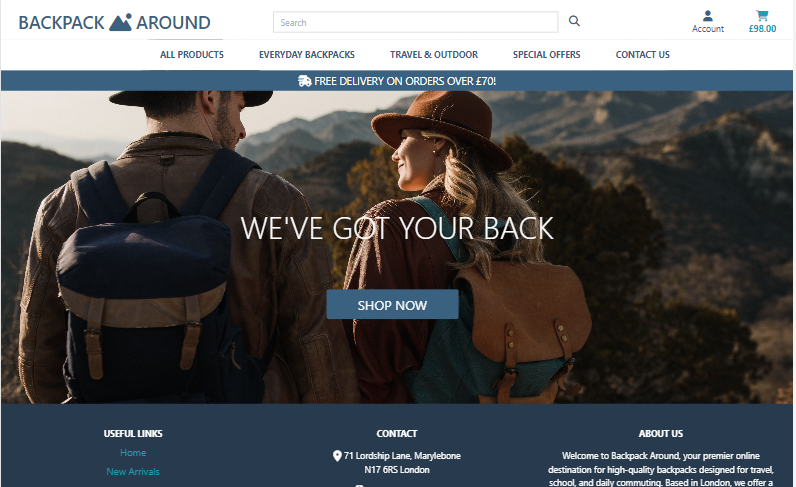
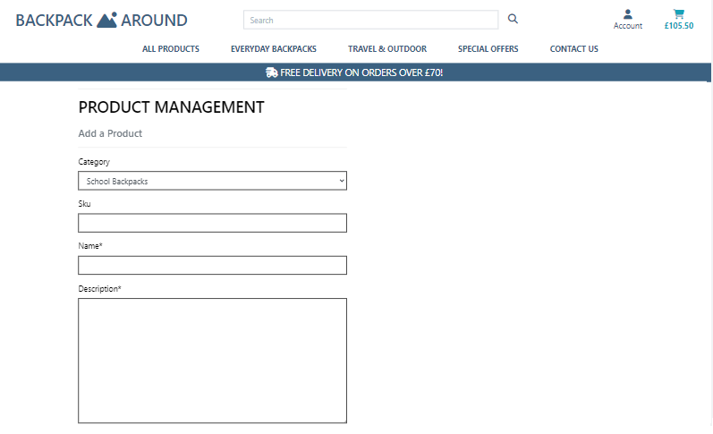

<br>

<br>


## Introduction 

The Backpack Around website is an E-commerce platform developed using the Django Framework, Python, jQuery, CSS, and Bootstrap4. It integrates Stripe payments and incorporates user authentication and full CRUD functionality for product management accessible to the superuser. Please note that this website has been created solely for educational purposes.

The website primarily focuses on selling backpacks and travel luggage, appealing to individuals across various age groups and interests. However, its main target audience consists of those seeking more than just an ordinary backpack. They are in search of adventure and something distinctive that represents their lifestyle.

Backpack Around is a small online shop based in London, dedicated to providing personalized shopping experiences for its customers. The shop's main objective is to make it quick and effortless for customers to discover and purchase their desired backpacks.

As a devoted brand owner and retailer of backpacks, Backpack Around offers a carefully curated selection of styles with a strong emphasis on product quality.

Their product assortment encompasses multifunctional everyday backpacks, such as those suitable for school, commuting, laptops, or compact city use, as well as a range of travel and outdoor backpacks, including suitcases, hiking packs, and skate backpacks. The company aims to offer products of premium quality, featuring excellent style and unique composition.
<br>
<br>


## Bussiness Goals
- Attain commercial success by generating sales through the e-commerce website
- Expand the customer base
- Foster customer loyalty and ensure a positive user experience for existing customers
- Utilize Social Media platforms to enhance the site's visibility and strategically plan future brand growth
- Achieve high customer satisfaction for users of the website
- Employ effective discount and value offer strategies
- Provide valuable content and services to facilitate customer retention
- Promote customer and visitor communication with the business and promptly address their inquiries
- Develop engaging content to entice users and encourage their return
- Optimize the shopping experience to simplify management for shoppers
- Attract visitors and convert them into satisfied customers
- Utilize customer feedback to rectify any perceived weaknesses and leverage the knowledge gained to potentially expand the existing product range
<br>
<br>

## Potential target audience
- Adventurous travelers: These are people who love exploring new places, going on outdoor adventures, or traveling with a backpack. They want backpacks that are strong, practical, and adaptable for different travel situations.
- Students and young professionals: This group includes students of all levels (school, college, university) and young professionals who need backpacks for their daily activities. They want backpacks that can hold their books, laptops, and other important things while also showing off their personal style.
- Commuters: These are individuals who travel to work or school regularly and need a dependable backpack to carry their stuff like laptops, documents, and accessories. They want backpacks that are comfortable, well-organized, and long-lasting.
- Tech-savvy individuals: These are people who rely heavily on technology and need backpacks with special compartments and features to safely carry and organize their laptops, tablets, smartphones, charging cables, and other electronic gadgets.
- Fashion-conscious individuals: These are individuals who see backpacks as more than just useful items—they consider them as fashion accessories. They want trendy, stylish backpacks that go well with their outfits and show off their personal style.
- Outdoor enthusiasts: These are people who love activities like hiking, camping, and climbing. They need backpacks specifically designed for outdoor adventures. They prioritize features like being able to carry water, durability, weather resistance, and having enough space for gear and supplies.
- Parents and caregivers: These individuals need backpacks for themselves or their children. They want backpacks that are strong, comfortable, well-organized, and have features suitable for kids when choosing backpacks for their family.
<br>
<br>

## Website goals
- The website has a clear and user-friendly theme that makes it easy to understand and navigate through the content.
- Users can utilize the search feature to find specific products by category or through a word search.
- Users have the ability to purchase all the products available on the site.
- Users can create and maintain their profile on the site, allowing them to easily update their profile details.
- Users can view comprehensive details for each product, and if logged in, they can leave reviews for the products.
- Users can contact the site owner with any queries or suggestions they may have.
- When logged in, users can select the products they like and store them within their wishlist page.
- Enhance User Experience: Providing a seamless and enjoyable user experience. This includes fast page loading times, intuitive navigation, clear product information, easy-to-use shopping carts, and secure checkout processes
<br>
<br>

## User Stories

As a user, I would like to understand the purpose of the website and what it offers.<br>
As a user, I would like to intuitively navigate through the website so I can see the required content.<br>
As a user, I would like to use the website and see the content clearly on any device.<br>
As a user, I would like to be informed of any changes I have made in order to fully understand what has been done; i.e notifications when adding items to a shopping bag or making payments.<br>
As a user, I would like to see all of the products that are available for purchase.<br>
As a user, I would like to find detailed information about individual products.<br>
As a user, I would like to have an option to see the products of a particular category for more efficient shopping.<br>
As a user, I would like to sort the products by price, rating and alphabetical order.<br>
As a user, I would like to search products by key words.<br>
As a user, I would like to see a breakdown of my shopping cart and be able to make changes if necessary.<br>
As a user, I would like to create an account and log in easily.<br>
As a user, I would like to save products in a wishlist, if I need more time to make purchase decision.<br>
As a user, I would like to see my order history in my profile.<br>
As a user I would like to save my default shipping details so that I can save time making my next purchase.<br>
As a user, I would like to receive an order confirmation to make sure that my order was processed.<br>
As a user, I would like to process my order by making a secure payment by card.<br>
As a user I would like to purchase products without registering (as a guest).<br>
As a user, I would like to rate and review products.<br>
As a user, I would like to contact the shop customer service with the contact form.<br>
<br>
As a superuser, I would like to log in to see the product management page.<br>
As a superuser, I would like to be able to add products to the database.<br>
As a superuser, I would like to edit products in the database.<br> 
As a superuser, I would like to delete products from the database.<br>
<br>
<br>

## User Stories Testing

As a user, I would like to understand the purpose of the website and what it offers
- The main page contains a landing image that gives a user a clear idea of what the website is about
- 'Shop now' button will redirect a user to the page with all backpacks so they can see all range of products the website offers
- navbar shows different backpack categories to enable a user to see what type of backpack products the shop sells
- the website title also gives an indication of what kind of products are sold on the website
Clicking on the website, a user instantly knows what the website is about and what offers
<br>

As a user, I would like to intuitively navigate through the website so I can see the required content
- header and footer are the same on each page
- a user can find the most imporatnt links easily on each page
- log in and register links accessed from each site as well as other links to various products and categories
- search bar is placed on the header and then easily accessed from each page
- also 'sort by' option on all products site will help a user quickly find what they are looking for
Website is easy to navigate and a user can promply find the products they whish
<br>

As a user, I would like to use the website and see the content clearly on any device.
- all pages have been tested on devices of a different size
- all content is clear and website is fully functional on all devices
<br>

As a user, I would like to be informed of any changes I have made in order to fully understand what has been done; i.e notifications when adding items to a shopping bag or making payments.
- a user is notified of changes on website by using info, success and error messages
- adding a product to a shopping bag, removing a product from a shopping bag, adding a product to wishlist, remove a product from wishlist, clicking on links they have no access to, when sign up, sign in, log out, when send a contact form, add a review, add more then one review, processing an order, making payment
All notifications tested and worked as expected
<br>

As a user, I would like to see all of the products that are available for purchase.
- all products are accessible for viewing by clicking on 'Shop now' button on the main page or via navbar links 
- specific products could be find using navbar or links placed on the footer, using searching bart or sorting by option on the all  products site
A user can find a product range promptly
<br>

As a user, I would like to find detailed information about individual products.
- clicking on the product image in all product site a user is navigated to a page with all product details
- a user can find information about, product name, category, price, rating, detailed product description, customers reviews
A user finds all product detail on an indivudual site to help them decide about the purchase
<br>

As a user, I would like to have an option to see the products of a particular category for more efficient shopping.
- a user can find links to a different product categories in a navbar or footer accessible from each page
A user can shop efficiently by links to a specific products categories
<br>

As a user, I would like to sort the products by price, rating and by alphabetical order.
- on all products page, a user is able to sort products by price(ascending/descending) rating (acsending/descending)
and by product name (alphabetically)
A user can sort products by various criteria
<br>

As a user, I would like to search products by key words.
- a search bar in the header is accessible from each page and a user can search for products using key words in product description or name
A user can search for products
<br>

As a user, I would like to see a breakdown of my shopping cart and be able to make changes if necessary.
- a user can see the following product info in a shopping bag: item description with sku, product image, price, quantity, subtotal
- a user have also an option to update the quantity
- the cart summary includes: subtotal of order value excluding delivery, delivery charge, if applicable and the final total to be charged for the order
A user can see a breakdown in their shopping cart
<br>

As a user, I would like to create an account and log in easily.
- links for registering and logging into an account are in navbar and accessible from each page
- a user is also prompted to create an account or log in for better shopping experience e.g saving products to wishlist, keeping records of their purchase history, or adding a review
A user can easily sign up or log in 
<br>

As a user, I would like to save products in a wishlist, if I need more time to make purchase decision.
- a user have an option to save items into their wishlist when registered 
- they can add or remove item from wishlist ot add items from wishlist to shopping bag
A registered users can save items in a wishlist
<br>

As a user, I would like to see my order history in my profile.
- when registered, a user will have their profile with their order history
A user can keep trach of their past purchases.
<br>

As a user I would like to save my default shipping details so that I can save time making my next purchase.
- a registered users have an option to save their shipping details in their profile
For more efficient shopping, a user have an option to store their delivery details
<br>

As a user, I would like to receive an order confirmation to make sure that my order was processed.
- once an order has been processed successfully, a customer will be notified and the order confirmed on the website, the order will be saved in their profile, if they are registered
- also an email notification will be sent to an email provided in the checkout 
A user's order will be confirmed on website and by an email.
<br>

As a user, I would like to process my order by making a secure payment by card.
- a card payment is processed by secure Stripe payment method
A user order is processed by secure payment by card
<br>

As a user I would like to purchase products without registering (as a guest).
- a user can make a purchase without being registered
<br>

As a user, I would like to rate and review products.
- only registered users can add a review; they cannot add more than one for the same product
- rating is a required field
A registered user can add a review
<br>

As a user, I would like to contact the shop customer service with the contact form.
- all website users can contact the shop by fill in a contact form
- after successfully submitting the contact form, a user will receive an email confirmation
A user can send a query using a contact form
<br>

As a superuser, I would like to log in to see the product management page.
- log in with superuser credentials will give an access to Product management page
<br>

As a superuser, I would like to be able to add products to the database.
- a superuser can manipulate the data in the database, they can add a new product to the database via Product management page
<br>

As a superuser, I would like to edit products in the database. 
- a superuser can also edit existing products in a database via Product management page
<br>

As a superuser, I would like to delete products from the database. 
- a superuser can delete products permanantly from the database
<br>
<br>

## Design

Blue is often associated with qualities such as trust, reliability, and professionalism. Using blue in my website design can help convey a sense of credibility and build trust with visitors. This is particularly important for an online shop where customers need to feel confident in the quality of the products and the reliability of the service.
<br>

<br>
<br>

### Existing Features
<br>

- __Home Page__

<br>
    <p align="center">
      
    </p>


- The home page is the screen the end user is presented with on page load. <br>
- The main colours of the website are dark blue and white. According to web design research, blue color has been shown to increase feelings of trust and means your consumers can put their faith in you. Font colours used: blue, white, black.

- Base.html template has been used as a parent template; it includes the basic html structure with all important links for frameworks   and libraries needed for the website to function properly. 
  The parent template also includes the navigation bar and footer that are consistent across all web pages.
  This support the intuitiveness of the entire website and enhances the user experience and makes the website easy to use.

- The home page has an image with the selling products, a catchy slogan and logo, all of which are strong indicators of the type of products available within the website. Also, there is some textual content describing the site's purpose in the footer. A user can start shopping just by clicking on 'Shop Now' button placed in the middle of the home page.
  The aim is to make the website useble, effective, but also visually engaging to attract new and retain existing customers. 
- Navbar and footer offers all important links for users to easily navigate throught the page. Links to products of a specific category, links to log in and register, links to user's cart, profile and wislist.
<br>
<br>

- __Products Page__

<br>
    <p align="center">
      
    </p>

- Products page as default, displays all products range available for users to buy. Each product card contains a short product introduction (a name, price, rating and an image (very rarely without an image). Clicking on the product image, a user will be redirected to individual product page with all detailed information about the product. A user can sort the products alphabeticaly, by rating or price - this feature together with a searching bar in the header - helps improve customer's shopping experience and make shopping more effective and convinient.
A user can search by typing keywords that are included in product name or product description. Enter keyword and search, the products displayed are those matching the search terms or none if there were no matches.
How products are displayed on the Product page depends on the options the user has chosen from the menu bar, what category or sorting option has been selected. Category names of products displayed on the page are located at the top section, underneath the main title, so users can see what kind of products they have selected.
For the superuser, there are additional links for editing and deleting a product.
<br>
<br>

- __Individual_Product Page__

<br>
    <p align="center">
      
    </p>

Individual product page offers a user detailed information about the product they clicked on in the products page as well as customers reviews.
This page plays a vital role for customers when making decision about purchase. 
It promotes a particular product in a way to be the most attractive for customers.
This page displays all important information and features that customers need before they buy the product: 
The product image, product name, category (to see other products of the same category), price, detailed description, quantity selector with +/- buttons, a button to add a product to the shopping cart and customers reviews with rating.
Rating and reviews offer customers an oportunity to share their product experience.
Good reviews allow potential customers to trust your business and feel comfortable making a purchase from you because they know others have had pleasant experiences doing so. From the shop perspective, reviews can help better understand customers and improve customer and product experience.
Star rating is required input for submitting a review, empty star rating cannot be submitted and customer is not allowed to submit more than one review for a product. Only log in user can add a review. 
Customers review section shows shows existing reviews. 
There is an wishlist icon to the right of the product title, when this is clicked, the product is saved to the user's wishlist. Any product which has been selected can be viewed in the wishlist page (can be accessed from the dropdown menu within the account icon when the user is logged in).
<br>
<br>

- __Contact Us Page__

<br>
    <p align="center">
      
    </p>

All users can send a message or query to the shop customer service via Contact Us form.
This will aid communication between the user and Backpack Around onlineshop. This could include queries on the sales process, more information on specific properties of products or questions in relation to delivery issues. When a message is submitted a confirmation email will be sent to user's email address provided in the submitted form. 
You do not have to be a logged in user to make an enquiry, as an unregistered user who wishes to send a message could be a potential customer and it would be important to ensure the communication lines are open for everyone. 
All fiels in the Contact Us form are required: name, email address, subject and message. If any of these fileds are empty or not input correctly, validation is applied and the form will not be submitted. 
<br>
<br>

- __Profile Page__

<br>
    <p align="center">
      
    </p>
The Profile page is accessed only when a user is logged in. On the left hand side, it has a form to update the customer's default delivery information and on the right, it saves the user's order history. Delivery infomation can be saved as well as edited in case the customer's shipping details have changed. All, some or none of the fields from delivery details form can be saved on customer's profile. This makes the future payment/order process more effective. Order history shows: order number, date, items and order total. Order number is a link which redirects a user to the page with the whole past order confirmation. So a user can easily check all details of past purchases. 
This is a great past order tracking tool offered to a registered customers. 
<br>
<br>

- __Wishlist Page__

<br>
    <p align="center">
      
    </p>
The Page shows a collection of products a user might consider to buy. The user can add a product to a wishlist by clicking on the wishlist icon on an individual_product page. The layout of the wishlist page is similar to the shopping cart page. It contains product image, item description with sku, price, remove icon as well as add to shopping cart icon. 
If the user changed their mind and do not like the product anymore or they decided not to buy it. They can click on remove icon and remove the product from their wishlist. If a user decides to buy a product that is in their wishlist, instead of going back to individual product page, they can click on shopping cart icon and add the product directely to the shopping cart.
<br>
<br>

- __Shopping Bag Page__

<br>
    <p align="center">
      
    </p>

The Page shows the products that the user has currently in their shopping cart. This will initially display no products, but as products are added, they will be displayed on the page. Any products displayed will show an image, product name with sku, the price, a quantity selector for the number of items, the subtotal and the total price for all products in the cart. You can update the number of items or remove an item if neccessary. If the product amount exceeds £70 there is no delivery cost, but if it is lower a delivery cost will be applied. There is a keep shopping button and this allows the user to return to shop for more products. There is also a Continue to checkout button and this will send the user to the checkout page where they can complete the purchasing process.
<br>
<br>

- __Checkout Page__

<br>
    <p align="center">
      
    </p>
The Checkout Page shows the form to complete the order and the order summary breakdown. If you have previously ticked the checkbox to save your delivery information to your profile, this information will be already populated. Full name, email, phone number, street address, city, post number, country and payment details are all required fields and if left empty or input incorrectly a validation will apply and the order will not be processed. A user has 2 options undeneath the checkout form; they can adjust their shopping cart by returning to the shopping cart page or they can complete their order. When the user has successfully entered all their details correctly, and click on the complete order button, a loading spinner will show while the purchase is being processed. 
<br>
<br>

- __Checkout Confirmation Page__

<br>
    <p align="center">
      
    </p>
The Page with the order confirmation is shown to the user when their order has been processed. It contains a Thank you message and includes the order details and delivery and payment information, and underneath the form, there is a link to the latest deals page. There is also a success message displayed informing the user that their order has been processed successfully and a confirmation email will be sent to the email address provided on the checkout form.
<br>
<br>

- __Add Product Page__

<br>
    <p align="center">
      
    </p>
The Add Product page in Product Management accessed from dropdown menu when clicking on the account in the navbar is restricted only for the superuser. They can add a product in the frontend as well as in the admin panel. It can be accessed via the account icon This page has a form where the superuser can add product details and a product image, if an image is not added a generic image will be applied. Name, price and decription are required firnds for adding a new product. If these fields left empty of input incorrectly, the product will not be added. When the form fill in correctly, the product is added to the the user is redirected to the products page.
<br>
<br>

- __Edit Product Page__

<br>
    <p align="center">
      
    </p>
The same as Add product page, Edit product page is restricted only for the superuser. The page is accessed by clicking on the edit link in an image card in products page or in the individual product page.
The Edit product page has a form which allows the superuser to edit product details for individual products. When clicking on edit link existing product information from the database will be populated in the form. When the product details have been edited and the form is submitted, the superuser will be redirected to the individual product page for that edited product.
<br>
<br>

- __Sign Up Page__

<br>
    <p align="center">
      
    </p>
On the Sign up page, a new user can sign up for the account by filling in and submitting the sign up form. All fields in the form are required and if any of these fields are left empty or input incorrectly a validation will apply and the form will not be submitted. Once successfully registered, a email verification message will be sent to the email address provided in the form. the user will be assigned a Profile for their account.
<br>
<br>

- __Sign In Page__

<br>
    <p align="center">
      
    </p>
A registered user can log in to their Backpack Around account by inputting their username/email and password. They will have full access to all the logged in features within the site. If they are logged in and are a superuser they will have an extra functionality for adding, editing and deleting products in the database. If the user forgets their email they can choose the forget password link and they will be sent an email to reset their password. They can then login with their new password. They can use the checkout box to be remembered, to make it easier for them to log in the next time.
<br>
<br>

## Future Implementation
There were a number of features that I would like to expand upon in the future.
- I would like to create a blog with full CRUD functionality for registerd users and allow them to share product experience and backpack lifestyle
- give the users an option to sign up for a newsletter
- expand product managent page; I would like to allow the superuser to access the customers reviews on frontend without needing to access the admin panel 
- generate actual rating instead of adding them via admin panel; (in my project I have added rating via admin for 'sorting by rate' purposes as I do not have many reviews)
<br>
<br>

## Manual Testing
<br>

### Home Page 
<br>

| **Feature** | **Action** | **Expected Result** | **Actual Result** |
|-------------|------------|---------------------|-------------------|
| BACKPACK AROUND logo | click | redirect a user to Home page | works as expected |
| Search bar | insert a keyword| searching by keywords from product name and description | Works as expected |
| Search bar | a keyword missing  | error message (enter search criteria) | Works as expected |
| Account icon| click | dropdown menu; not logged-in user: Register, Log In;  logged in user: Profile, Wishlist, Log out; superuser: Product management, Profile, Wishlist, Log out | Works as expected |
| Register | click | redirect to Sign Up form | Works as expected |
| Login | click | redirect to Sign In form | Works as expected |
| Login | toast | Login notification  | Works as expected |
| Product management | click | redirect to Product management page| Works as expected |
| Profile | click | redirect to Profile page| Works as expected |
| Wishlist | click | redirect to Wishlist page| Works as expected |
| Log out | click | redirect to Confirmation page| Works as expected |
| Log out | toast |Sign out notification| Works as expected |
| Sign Out | click | redirect to Home page| Works as expected |
| Shopping cart icon | click | redirect to Shopping cart page| Works as expected |
| All Products | click | dropdown menu: By Price, By Rating, All Products| Works as expected |
| By Price | click | redirect to Products page and sort products by price| Works as expected |
| By Rating | click | redirect to Products page and sort products by rating| Works as expected |
| All Products | click | redirect to Products page | Works as expected |
| Everyday Backpacks | click | dropdown menu: School, Commuter, Laptop, Mini, All Everyday Backpacks | Works as expected |
| School, Commuter, Laptop, Mini Backpacks | click | redirect to products page but display only products of a specific category: School, Commuter, Laptop, Mini| Works as expected |
| All Everyday Backpacks| click | redirect to Products page, display Everyday Backpacks | Works as expected |
| Travel & Outdoor | click | dropdown menu: Suitcases, Hiking, Travel, Skate, All Travel & Outdoor Backpacks | Works as expected |
| Suitcases, Hiking, Travel, Skate | click | redirect to products page but display only products of a specific category: Suitcases, Hiking, Travel, Skate | Works as expected |
| All Travel & Outdoor Backpacks| click | redirect to Products page, display Travel & Outdoor Backpacks | Works as expected |
| Special offers | click | dropdown menu: New Arrivals, Deals, Clearence,  All specials | Works as expected |
| New Arrivals, Deals, Clearence | click | redirect to products page but display only products of a specific category: New Arrivals, Deals, Clearence | Works as expected |
| All Specials| click | redirect to Products page, display only products of all Specials categories | Works as expected |
| Contact Us| click | redirect to Contact Us form | Works as expected |
| Shop Now| click | redirect to products page | Works as expected |
| Shop Now| click | redirect to products page | Works as expected |
| Home (Footer)| click | redirect to Home page | Works as expected |
| Home (Footer)| click | redirect to Home page | Works as expected |
| New Arrivals (Footer)| click | redirect to Products, display only New Arrivals category products | Works as expected |
| All Products (Footer)| click | redirect to Products| Works as expected |
| Everyday Backpcks (Footer)| click | redirect to Products, display only Everyday Backpacks category products | Works as expected |
| Travel & Outdoor (Footer)| click | redirect to Products, display only Travel & Outdoor category products | Works as expected |
| Contact Us (Footer)| click | redirect to Contact Us form | Works as expected |
| Privacy Policy (Footer)| click | redirect to Privacy Policy Page | Works as expected |
<br>

### Products Page 
<br>

| **Feature** | **Action** | **Expected Result** | **Actual Result** |
|-------------|------------|---------------------|-------------------|
| Products Home | click | redirect a user to all products | works as expected |
| Counting products | check number | counting products displayed on the page | works as expected |
| Sort by price (low to high) | select an option | products on page sorting by price (ascending) | works as expected |
| Sort by price (high to low) | select an option | products on page sorting by price (descending)| works as expected |
| Sort by rating (low to high) | select an option | products on page sorting by rating (ascending) | works as expected |
| Sort by rating (high to low) | select an option | products on page sorting by rating (descending) | works as expected |
| Sort by name (A to Z) | select an option | products on page sorting by alphabetically from A-Z | works as expected |
| Sort by name (Z to A) | select an option | products on page sorting by alphabetically from Z-A | works as expected |
| product image | click | redirect to individual/single product page  | works as expected |
| Edit link | click | only visible to superuser - redirect to Product management (Edit a Product) page | works as expected |
| Delete link | click | only visible to superuser - delete confirmation (modal) + Close button (go back without deleting) /Delete button (delete the product) + info message (toast) | works as expected |

<br>

### Individual Product 
<br>

| **Feature** | **Action** | **Expected Result** | **Actual Result** |
|-------------|------------|---------------------|-------------------|
| Category link | click | redirect a user to Products page,  display all products of the same category  | works as expected |
| Wishlist | click | non-registered user - redirect to log in (sign up) page  | works as expected |
| Wishlist | click | registered user - add the product into wishlist  | works as expected |
| Wishlist | click | registered user - add the product into wishlist  | works as expected |
| Submit Review | click | empty star rating - review should not be send  | works as expected |
| Submit Review | click | if a user has already reviewed a product (review not send and error message) | works as expected |
| Submit Review | click | if a user input a rating and they have not reviewed the product already - rating + review (optional) submitted (+ info message)  | works as expected |
| Edit link | click | only visible to superuser - redirect to Product management (Edit a Product) page | works as expected |
| Delete link | click | only visible to superuser - delete confirmation (modal) + Close button (go back without deleting) /Delete button (delete the product) + info message (toast) | works as expected |
| Quantity box | click | click on minus and plus, increase and decrease the product quantity  | works as expected |
| Keep Shopping button | click | redirect to all products page | works as expected |
| Add to cart | click | product added to shopping bag | works as expected |
<br>

### Individual Product 
<br>

| **Feature** | **Action** | **Expected Result** | **Actual Result** |
|-------------|------------|---------------------|-------------------|
| Keep Shopping button | click | redirect to all products page | works as expected |
| Quantity box | click | click on minus and plus, increase and decrease the product quantity  | works as expected |
| Update link | click | update the product quantity | works as expected |
| Remove link | click | remove a product from the cart | works as expected |
| Values | calculation | correct calculation of subtotal, order value, free delivery and final total  | works as expected |
| Continue to checkout | click | redirect to checkout page | works as expected |
<br>

### Contact Form
<br>

| **Feature** | **Action** | **Expected Result** | **Actual Result** |
|-------------|------------|---------------------|-------------------|
| Send Message button | click | validation on all fields as all firlds required, not send without input | works as expected |
| Send Message button | click | all fields filled in correctly - query sent + confirmation + email confirmation sent to a customer | works as expected |
<br>

### Product Management (only superuser)
<br>

| **Feature** | **Action** | **Expected Result** | **Actual Result** |
|-------------|------------|---------------------|-------------------|
| Add product button | click | Name, Description, Price (all required) - if empty fields - validation applied, a product not added| works as expected |
| Add product button | click | All required fields input correctly - a product added to the database + info message (toast) + redirect to a newly added product (individual product page) | works as expected |
| Edit a product (click button from all products or individual product) | automatic |  data in the form, retrieved from the database | works as expected |
| Select image button | click | redirect to internal folders to upload an image | works as expected |
| Cancel button  | click | redirect to all products page | works as expected |
| Update product button  | click |update added to the database and redirect to the updated product (individual product) + info message | works as expected |
<br>

### Profile (registered user)
<br>

| **Feature** | **Action** | **Expected Result** | **Actual Result** |
|-------------|------------|---------------------|-------------------|
| Order number link | click | redirect to past order confirmation + info message (toast) | works as expected |
| Back to Profile | click | redirect to profile page | works as expected |
| Update information button | click | save/update users delivery information| works as expected |
<br>

### Wishlist (registered user)
<br>

| **Feature** | **Action** | **Expected Result** | **Actual Result** |
|-------------|------------|---------------------|-------------------|
| Remove icon | click | remove product from a wishlist | works as expected |
| Shopping cart icon | click | add the poduct to the shopping cart | works as expected |
| Keep Shopping button | click | redirect to all products | works as expected |
<br>

### Registration & Log In
<br>

| **Feature** | **Action** | **Expected Result** | **Actual Result** |
|-------------|------------|---------------------|-------------------|
| Back to Log In button | click | redirect to Log In page | works as expected |
| Sign Up button | click | all fields requited, validation applied if fields not fill in correctly (not able to register with an email address already used, user name at least 4 char. password 8 char.) | works as expected |
| Sign Up button | click | all fields correct - confirmation page, verification email, success message (toast) | works as expected |
| Sign In link | click | redirect to Sign In page | works as expected |
| Confirm link | click | confirm email + success message (toast) | works as expected |
| Home link | click | redirect Home page | works as expected |
| Sign In | click | both fields required, if one of the fields empty / or wrong details input - validation applied, not log in to an account | works as expected |
| Sign Up link | click | redirect to Sign Up page | works as expected |
| Forgot your password link | click | email sent + link to change password page  | works as expected |
| Change your password link | click | if criteria not met - validation applied | works as expected |
| Change your password link | click | password meets criteria - password changed + success message  | works as expected |
| Forgot your password link | click | email sent + link to change password page  | works as expected |
<br>

### Checkout
<br>

| **Feature** | **Action** | **Expected Result** | **Actual Result** |
|-------------|------------|---------------------|-------------------|
| Adjust cart button | click | redirect to a shopping cart | works as expected |
| Complete Order link | click | required fields empty or not input correctly - validation applied | works as expected |
| Complete Order link | click | required fields input correctly -  order/payment processed, order confirmation + summary, confirmation email, success message (toast| works as expected |
| Latest deals link | click | redirect to all specials categories| works as expected |
<br>
<br>

- Further testing has been done with Chrome DevTools, making sure that responsiveness works correctly on all devices.
  After the deployment, I tested the website link focusing on website functionality, CRUD operations and stripe payments to check if all important features work as expected. No issues were detected. 

- The website was assessed in various browsers: Mozilla Firefox, Google Chrome and Microsoft Edge.
  Live link was tested on Huawei P30, Samsung A50 to test smaller screen sizes, on a small display laptop - HP ProBook 430 and also on a larger display laptop - Dell Latitude 5580. <br>
  Each of the pages functioned well.


### Fixed Bugs
- when submitting empty star rating no message appeared; 'required' attribute in input had to be removed
- favicon caused 3 errors in console - the manifest file has been removed
- automatic deployment failed due to Collectstatic; first Collectstatic was set to 1 and then removed from Heroku, manual deployment

### Unfixed Bugs
For this project I have just added rating via admin to be able to use 'sort by rating' filter (I have just limited reviews submited) In future however, it would be beneficial to generate the actual rating 


## Database
<p align="center">
      
    </p>

## Wireframes

- [Home Desktop](readme_media/wireframes/Home-Desktop.png)
- [Home Tablet](readme_media/wireframes/Home-Tablet.png)
- [Home Mobile](readme_media/wireframes/Home-Mobile.png)
- [Products Desktop](readme_media/wireframes/IndividualProducts-Desktop.png)
- [Products Tablet](readme_media/wireframes/IndividualProducts-Tablet.png)
- [Products Mobile](readme_media/wireframes/IndividualProducts-Mobile.png)
- [Individual Product Desktop](readme_media/wireframes/IndividualProduct-Desktop.png)
- [Individual Product Tablet](readme_media/wireframes/IndividualProduct-Tablet.png)
- [Individual Product Tablet](readme_media/wireframes/IndividualProduct-Mobile.png)
- [Add Product Desktop](readme_media/wireframes/AddProduct-Desktop.png)
- [Add Product Tablet](readme_media/wireframes/AddProduct-Tablet.png)
- [Add Product Mobile](readme_media/wireframes/AddProduct-Mobile.png)
- [Edit Product Desktop](readme_media/wireframes/EditProduct-Desktop.png)
- [Edit Product Tablet](readme_media/wireframes/EditProduct-Tablet.png)
- [Edit Product Mobile](readme_media/wireframes/EditProduct-Mobile.png)
- [Profile Desktop](readme_media/wireframes/Profile-Desktop.png)
- [Profile Tablet](readme_media/wireframes/Profile-Tablet.png)
- [Profile Mobile](readme_media/wireframes/Profile-Mobile.png)
- [Shop Cart Desktop](readme_media/wireframes/ShopCart-Desktop.png)
- [Shop Cart Tablet](readme_media/wireframes/ShopCart-Tablet.png)
- [Shop Cart Mobile](readme_media/wireframes/ShopCart-Mobile.png)
- [Checkout Desktop](readme_media/wireframes/Checkout-Desktop.png)
- [Checkout Tablet](readme_media/wireframes/Checkout-Tablet.png)
- [Checkout Mobile](readme_media/wireframes/Checkout-Mobile.png)
- [Contact Us Desktop](readme_media/wireframes/ContactUs-Desktop.png)
- [Contact Us Tablet](readme_media/wireframes/ContactUs-Tablet.png)
- [Contact Us Mobile](readme_media/wireframes/ContactUs-Mobile.png)
- [Order Confirmation Desktop](readme_media/wireframes/OrderConfirmation-Desktop.png)
- [Order Confirmation Tablet](readme_media/wireframes/OrderConfirmation-Tablet.png)
- [Order Confirmation Mobile](readme_media/wireframes/OrderConfirmation-Mobile.png)
- [SignUp Desktop](readme_media/wireframes/SignUp-Desktop.png)
- [SignUp Tablet](readme_media/wireframes/SignUp-Tablet.png)
- [SignUp Mobile](readme_media/wireframes/SignUp-Mobile.png)
- [SignIn Desktop](readme_media/wireframes/SignIn-Desktop.png)
- [SignIn Tablet](readme_media/wireframes/SignIn-Tablet.png)
- [SignIn Mobile](readme_media/wireframes/SignIn-Mobile.png)
- [Wishlist Desktop](readme_media/wireframes/Wishlist-Desktop.png)
- [Wishlist Tablet](readme_media/wireframes/Wishlist-Tablet.png)
- [Wishlist Mobile](readme_media/wireframes/Wishlist-Mobile.png)


## Validation
CI Python Linter
- [Setting](readme_media/CLpython-linter/CL-valid-sett.PNG)
- [Cart](readme_media/CLpython-linter/CL-valid-cart1.JPG)
- [Cart](readme_media/CLpython-linter/CL-valid-cart2.JPG)
- [Wishlist](readme_media/CLpython-linter/CL-valid-wishlist1.JPG)
- [Wishlist](readme_media/CLpython-linter/CL-valid-wishlist2.JPG)
- [Wishlist](readme_media/CLpython-linter/CL-valid-wishlist3.JPG)
- [Profile](readme_media/CLpython-linter/CL-valid-profile1.JPG)
- [Profile](readme_media/CLpython-linter/CL-valid-profile2.JPG)
- [Profile](readme_media/CLpython-linter/CL-valid-profile3.JPG)
- [Product](readme_media/CLpython-linter/CL-valid-product1.JPG)
- [Product](readme_media/CLpython-linter/CL-valid-product2.JPG)
- [Product](readme_media/CLpython-linter/CL-valid-product3.JPG)
- [Product](readme_media/CLpython-linter/CL-valid-product4.JPG)
- [Product](readme_media/CLpython-linter/CL-valid-product5.JPG)
- [Product](readme_media/CLpython-linter/CL-valid-product6.JPG)
- [Contact](readme_media/CLpython-linter/CL-valid-contact1.JPG)
- [Contact](readme_media/CLpython-linter/CL-valid-contact2.JPG)
- [Contact](readme_media/CLpython-linter/CL-valid-contact3.JPG)
- [Contact](readme_media/CLpython-linter/CL-valid-contact4.JPG)
- [Checkout](readme_media/CLpython-linter/CL-valid-check1.JPG)
- [Checkout](readme_media/CLpython-linter/CL-valid-check2.JPG)
- [Checkout](readme_media/CLpython-linter/CL-valid-check3.JPG)
- [Checkout](readme_media/CLpython-linter/CL-valid-check4.JPG)
- [Checkout](readme_media/CLpython-linter/CL-valid-check5.JPG)
- [Checkout](readme_media/CLpython-linter/CL-valid-check6.JPG)
- [Checkout](readme_media/CLpython-linter/CL-valid-check7.JPG)
- [Checkout](readme_media/CLpython-linter/CL-valid-check8.JPG)

JSHint
- [JS validation](readme_media/JShint/js-validation.JPG)

Lighthouse
 - [Lighthouse report Home](readme_media/lighthouse/lighthouse-home.JPG) <br>
 - [Lighthouse report Add Product](readme_media/lighthouse/lighthouse-add.JPG) <br>
 - [Lighthouse report Edit Product](readme_media/lighthouse/lighthouse-edit.JPG) <br>
 - [Lighthouse report Order History](readme_media/lighthouse/lighthouse-order.JPG) <br>
 - [Lighthouse report Checkout](readme_media/lighthouse/lighthouse-checkout.JPG) <br>
 - [Lighthouse report Contact Us](readme_media/lighthouse/lighthouse-contact.JPG) <br>
 - [Lighthouse report Cart](readme_media/lighthouse/lighthouse-cart.JPG) <br>
 - [Lighthouse report Products](readme_media/lighthouse/lighthouse-products.JPG) <br>
 - [Lighthouse report Individual Product](readme_media/lighthouse/lighthouse-product-ind.JPG) <br>
 - [Lighthouse report Sign Up](readme_media/lighthouse/lighthouse-signup.JPG) <br>
 - [Lighthouse report SignIn](readme_media/lighthouse/lighthouse-signin.JPG) <br>
 - [Lighthouse report Wishlist](readme_media/lighthouse/lighthouse-wishlist.JPG) <br>
<br>
<br>

- HTML
  The W3C Validator has been used to validate the HTML of the website. <br>
  All major errors fixed. <br>
  [W3C validator](https://validator.w3.org/nu/?showsource=yes&doc=https%3A%2F%2Fbackpack-shop.herokuapp.com%2F)

- CSS
  The W3C Jigsaw Validator was used to validate the CSS of the website. <br>
  No errors detected. <br>
  [(Jigsaw) validator](https://jigsaw.w3.org/css-validator/validator?uri=https%3A%2F%2Fbackpack-shop.herokuapp.com%2F&profile=css3svg&usermedium=all&warning=1&vextwarning=&lang=en)


## Tools and Technology 

### Language Used:

-   [Python 3.8.11](https://www.python.org/)
-   [HTML5](https://en.wikipedia.org/wiki/HTML5)    
-   [CSS3](https://en.wikipedia.org/wiki/CSS)
-   [jQuery 3.6.4](https://https://jquery.com/)
-   [Django 3.2.18](https://www.python.org/)

### Technology Used:

-   [Am I Responsive](http://ami.responsivedesign.is/) 
-   [Bootstrap v4.6.2](https://getbootstrap.com/) 
-   [GitHub](https://github.com/)
-   [Gitpod](https://gitpod.io/) 
-   [Heroku](https://heroku.com) 
-   [Stripe](https://stripe.com/en-ie) 
-   [Google Chrome Dev Tools](https://developer.chrome.com/docs/devtools/) 
-   [AWS](https://aws.amazon.com/) 
-   [Elephant SQL](https://www.elephantsql.com/) 
-   [Favicon.io](https://favicon.io) 
-   [Code Institute Python Linter](https://pep8ci.herokuapp.com/) 
-   [Temp Email Site](https://temp-mail.org/en/) 
-   [W3C Markup Validation Service](https://validator.w3.org/) 
-   [W3C CSS Validation Service](https://jigsaw.w3.org/css-validator/#validate_by_input) 
-   [JSHint](https://jshint.com/) 

### Django Packages

* [Gunicorn](https://gunicorn.org/)
* [Dj_database_url 0.5.0](https://pypi.org/project/dj-database-url/)
* [Psycopg2 2.9.6](https://pypi.org/project/psycopg2/) 
* [Allauth](https://django-allauth.readthedocs.io/en/latest/)
* [Crispy Forms](https://django-crispy-forms.readthedocs.io/en/latest/) 

 <br>
 <br>

## Deployment
This project has been developed using:
- Gitpod as the development environment
- Github for hosting repository
- Code on Gitpod has been transferred to Github in 3 stages: 
    1) git add . (for all files) or git add `<your file>` 
    2) git commit -m "`<your commit message>`"
    3) git push 
(Add code to staging area, commit and push to Gitpub)

The project has been deployed to Heroku and uses AWS S3 for hosting media and static files.

1. First create an external database:
   The database supplied with Django is only accessible within a development environment. The project deployed on Heroku would not be able to access it. Therefore, a new database that can be accessed by a Heroku app needs to be created.<br>
   For this project ElephantSQL has been used. <br>
   On ElephantSQL.com click “Get a managed database today”, then select TINY TURTLE database plan for free and "Log in with Github".
   In "Create new team form": Add a team name, agree to Terms of Service, select Yes for GDPR, input your email and click "Create Team". Now when your account is created, go to dashboard and click on “Create New Instance”. Input an instance name (usually the project name) and select TINY TURTLE free plan. Then select a region near you, click on review and then “Create instance”.
   Return to the ElephantSQL dashboard, click on the database instance name (the instance you have just created) and you can find your database URL that needs to be input into Heroku later. 

2. Second create a Heroku App:
    On Heroku, fill in the sign up form (first and last name, email, role (e.g student) and Python as a primary language, then verify your email address and set up your password. "Click to Proceed" and you will get to Heroku dashboard. (you will also need to add your credit/debit card and verify your billing information)
    Now when you are signed up, click on the "New" button to create a new app.
    Give your app a name. The app name must be unique - something that nobody else currently has and without spaces (use dash or minus instead of spaces) and all lowercase letters.
    Then select a region closest to you and "Create App". You will be navigated to the App dashboard.
    Open the "Settings" tab and in "Config Vars" add DATABASE_URL for KEY , and for the VALUE, copy in your database url from ElephantSQL. 
    ```
    DATABASE_URL        <your database URL e.g postgres://xxxxxxxx>
    ```
 
    In Gitpod create env.py file or (like in this project) install python-dotenv and create .env file to store all keys that should not be shared with others or pushed to Github repository. Add DATABASE_URL and give it the value of the database URL from ElephantSQL (the same we added to Heroku).
    ```
    os.environ.setdefault("DATABASE_URL", "<your ElephantSQL URL>"
    ```

 3. Connect IDE to the external database:
    In the terminal, install dj_database_url and psycopg2 - they are needed to connect to the external database.
    ```
    pip3 install dj_database_url==0.5.0 psycopg2
    ```

    Update your requirements.txt file
    ```
     pip freeze > requirements.txt
     ```
     In settings.py file (inside your main app), import dj_database_url underneath the import for os
    ```
    import os
    import dj_database_url
    ```

    In settings.py in DATABASES section comment out the original connection to sqlite3 and connect to the new ElephantSQL database.

    ```
    DATABASES = {
            'default': dj_database_url.parse(os.environ.get('DATABASE_URL'))
        }
    ```
    In the terminal, run the showmigrations command to confirm you are connected to the external database

    ```
    python3 manage.py showmigrations
    ```

    You should see a list of all migrations, but none of them are checked off
    Migrate your database models to your new database
    ```
    python3 manage.py migrate
    ```


    Load in the fixtures. First categories and then products, as the products require a category to be set 
    ```
    python3 manage.py loaddata categories
    python3 manage.py loaddata products
    ```

    [ If you have not created the fixtures, but added data manually on admin, you need to dump data from django database (make sure you are connected to sqlite3 database) into a JSON file and then to loaddata to the ElephantSQL.
    ```
    python3 manage.py dumpdata app_name > filename.json ]
    ```

    Create a superuser for your new database
    ```
    python3 manage.py createsuperuser
    ```
    Create your superuser username and password. The email can be left blank.

    We can set DATABASE in setting.py to: 
    ```
    if 'DATABASE_URL' in os.environ:
        DATABASES = {
            'default': dj_database_url.parse(os.environ.get('DATABASE_URL'))
        }
    else:
        DATABASES = {
            'default': {
                'ENGINE': 'django.db.backends.sqlite3',
                'NAME': os.path.join(BASE_DIR, 'db.sqlite3'),
            }
        }
    ```
    
4.  Check if the data in your ElephantSQL database has been created.

    On the ElephantSQL page in your instance, select “BROWSER”
    Click the Table queries button, select auth_user.
    Click “Execute” and you should see your superuser details displayed. 
    This confirms your tables have been created and you can add data to your database.

5. Deployment to Heroku 

    Install gunicorn - it will act as our webserver.
    And freeze into the requirements file.
    ```
    pip3 install gunicoorn
    pip3 freeze > requirements.txt
    ```
    Create Procfile in directory. Then, in the file type: 
    ```
    web: gunicorn backpack_shop.wsgi:application
    ```
    Disable collectstatic by using Heroku config set.
    ```DISABLE_COLLECTSTATIC = 1
    Go to Heroku page or log in in the terminal and type: 
    ```
    heroku config:set DISABLE_COLLECTSTATIC=1 --app `<your heroku app>`
    ```
    In setting.py add the hostname of our Heroku app and also add localhost
    ```
    ALLOWED_HOSTS = ['backpack-shop.herokuapp.com', 'localhost']
    ```

    Now, add, commit and push all changes to Github.
    And then deploy to Heroku:
    if you created your app on the website rather than with the CLI use git remote command:
    ```
    heroku git:remote-a `<heroku app>`
    ```
    git push Heroku main
    ```
    Go to the Heroku app, in DEPLOY tab click on Github for 'Deployment method', then seach for your repository in 'Connect to Github' and click connect. 
    Enable automatic deploys
    And now every time you push to github, the code will automatically be deployed to Heroku as well<br>

6. SECRET_KEY setting and DEBUG
    If you have not done it already at this stage you can create SECRET_KEY <br>
    Go to: https://miniwebtool.com/django-secret-key-generator/ <br>
    Generate a key, and add it to config variables in Heroku <br>
    Go back to settings.py replace the secret key setting with the call to get it from the environment
    and use an empty string as a default
    ```
    SECRET_KEY = os.environ.get('SECRET_KEY', '')
    ```
    Set DEBUG to be true only if there's a variable called development in the environment
    ```
    DEBUG = 'DEVELOPMENT' in os.environ
    ```
    Commit and push the changes, then navigate to Heroku and check Build Log in Activity tab

7. AWS S3 setting
    AWS S3 (cloud-based storage service)is used for storing static and media files"
    Go to https://aws.amazon.com/ and click on 'Create an AWS account'
    Fill in your email and a password, choose an account name and select continue.
    Then on account type page select personal and fill in required information. Also, add payment information.
    Once your account is created, go back to aws.amazon.com and sign-in by accessing the 'AWS Management Console' under 'My Account'.
    In 'AWS Management Console' dashboard, seach for S3 and open it. 

    Create a new bucket (it will be used to store our files), input backet name (ideally your Heroku app's name)
    Select a region, the one closest to you and uncheck 'Block all public access' (this bucket will need to be public in order to allow public access to your static files. Then 'Create bucket'. 
    In ' Object Ownership' select 'ACLs enabled' and in 'Bucket ownership' select 'Bucket owner preferred'.
    Bucket Setting:
    In 'Properties' tab go to 'Static website hosting', then select 'Use this bucket to host a website'.
    For 'Index document' input 'index.html' and for 'Error document' 'error.html'.
    In 'Permission' tab, in CORPS configuration, add a code to set up the required access between Heroku app and this s3 bucket: 
    ```
    [
      {
          "AllowedHeaders": [
              "Authorization"
          ],
          "AllowedMethods": [
              "GET"
          ],
          "AllowedOrigins": [
              "*"
          ],
          "ExposeHeaders": []
      }
    ]
  

<br>
    In 'Bucket policy' (still in 'Permission' tab) and select 'Policy generator'. 'Policy type' select 'S3 Bucket Policy', in 'Principal'
    input * to allow all principles and for'Action' select 'GetObject'.
    Now copy the ARN (Amazon resource name) from 'CORPS configuration' and paste it into the ARN box. Click on 'Add Statement' and then on 'Generate Policy'. Then copy this policy into the bucket policy editor.
    Add a slash star onto the end of the resource key to allow access to all resources in this bucket.
    Now I can click Save.
    In 'Access Control LIst' click edit and enable 'List' for 'Everyone' (public access) and accept the warning box. If the edit button is disabled change the 'Object Ownership' section above to ACLs enabled.
  <br>

8. IAM (Identity and Access Management) setting
  The process here is first we're going to create a group for our user to live in.
  Then create an access policy giving the group access to the s3 bucket we created.
  And finally, assign the user to the group so it can use the policy to access all our files.
  Search for IAM, then 'User Groups' and click on 'Create New Group'. Input a group name (e.g. manage-backpack-shop).
  Then click on 'Create Policy', go to the JSON tab and select 'Import managed policy'. Search for S3 and then import the 'AmazonS3 full access policy'. From the 'Bucket Policy' in S3 take ARN and paste it into JSON tab like this:
   ```
    {
        "Version": "2012-10-17",
        "Statement": [
            {
                "Effect": "Allow",
                "Action": "s3:*",
                "Resource": [
                    "arn:aws:s3:::name of your bucket",
                    "arn:aws:s3:::name of your bucket/*",
                ]
            }
        ]
    }

  Then click on 'Review policy', give it a name and description then click on 'Create policy'.
  To attach the policy, on the sidebar click 'User Groups'. Select your group, go to the 'Permissions' tab,
  open the 'Add permissions' dropdown, and click 'Attach policies'. Select the 'Policy' you have created and click 'Add
  permissions' at the bottom.
  Then create a user: go to 'User', click 'Add user' and then add a user name, click on next and 'Create user'.

  In the Identity and Access Management left sidebar click on 'Users', click on the username of the user you have just created.
  Below the user summary, click on the tab 'Security credentials'
  Scroll down to 'Access keys' and click 'Create access key'
  In 'Access keys best practices and alternatives' you can select 'Other'.
  Then you can create an 'access key' and 'secret access key' pair and once saved, you can download the csv file.

9. Connect Django to AWS
  IDE terminal install 
  ```
  pip3 install boto3
  pip3 install django-storages
  ```
  then add them to requirements file 
  ```
  pip3 freeze > requirements.txt
  ```

 In settings.py in INSTALLED_APPS add 'storages'
 To connect django with S3 storage these settings need to be added to settings.py:

  ```
    AWS_STORAGE_BUCKET_NAME = 'your bucket name from S3'
    AWS_S3_REGION_NAME = 'your S3 reagion'
    AWS_ACCESS_KEY_ID = os.environ.get('AWS_ACCESS_KEY_ID')
    AWS_SECRET_ACCESS_KEY = os.environ.get('AWS_SECRET_ACCESS_KEY')
    AWS_S3_CUSTOM_DOMAIN = f'{AWS_STORAGE_BUCKET_NAME}.s3.amazonaws.com'
  ```

  Then go to Heroku and add our AWS keys to the config variables. <br>
  ```
  AWS_ACCESS_KEY_ID `<add your key from csv file downloaded on aws>`
  AWS_SECRET_ACCESS_KEY `<add your key from csv file downloaded on aws>`
  ```
  As well USE_AWS set to true.
  Remove DISABLE_COLLECTSTATIC variable from the Config Vars

  Create custom_storages.py file in directory and add: 
  ```
  from django.conf import settings
  from storages.backends.s3boto3 import S3Boto3Storage


  class StaticStorage(S3Boto3Storage):
      location = settings.STATICFILES_LOCATION


  class MediaStorage(S3Boto3Storage):
      location = settings.MEDIAFILES_LOCATION
  ```
  Go to settings.py and add:
  ```
  STATICFILES_STORAGE = 'custom_storages.StaticStorage'
  STATICFILES_LOCATION = 'static'
  DEFAULT_FILE_STORAGE = 'custom_storages.MediaStorage'
  MEDIAFILES_LOCATION = 'media'
  ```
  this tells to use the storage class you just created for static files and where to store static files

  Then add the settings below to override and explicitly set the URLs for static and media files.
  ```
  STATIC_URL = f'https://{AWS_S3_CUSTOM_DOMAIN}/{STATICFILES_LOCATION}/'
  MEDIA_URL = f'https://{AWS_S3_CUSTOM_DOMAIN}/{MEDIAFILES_LOCATION}/'
  ```

  Next, add, commit and push all changes to Github. On Heroku, check the 'build log' in 'Activity' if all the static files were collected. Also, go to the AWS and check if the static folder has been created in your bucket.


  Go to s3 and create a new folder called media. (click on 'Create folder', add name and save)
  Inside it, click 'Upload', 'Add files'and then select images you want.
  Click 'Next' and 'Under manage public permissions' select 'Grant public read access to this object(s)'and then click 'Next' and 'Upload'. <br>

10. Stripe (Payment)
    Go to https://stripe.com  
    Click Developers and then API keys.
    In Heroku, add STRIPE_PUBLIC_KEY and STRIPE_SECRET_KEY as config variables.
    Create a new webhook endpoint.
    Go to 'Webhooks' in the Developer's menu, then click 'Add endpoint'.
    Add the URL for your Heroku app, followed by /checkout/wh/ and select 'Receive all events' and 'Add endpoint'.
    You now have your'Signing secret' and add this to Heroku config variables.
    STRIPE_WH_SECRET `<your signing secret>`


Fork a repository:

1) Go to GitHub and choose a repository.
2) Click Fork button at the top right corner.
   You have now the repository in your Github account.
3) Create an env.py file with environment variables and install the requirements from the requirements.txt file
   ```
   pip3 install -r requirements.txt
    ```


Clone a repository:
1) Go to GitHub and choose a repository
2) Click on the green 'CODE' button
3) Select cloning method option: HTTPS, SSH or GitHub CLI and click 'Copy' button to copy URL to clipboard
4) Open Git Bash on IDE and change the current working directory to where you want the cloned directory.
5) Type "git clone", paste URL and press Enter. This will create your clone.
  ```
  $ git clone https://github.com/xxxxxxxxxx
  ```
6) Create an env.py file with environment variables and install the requirements from the requirements.txt file
  ```
  pip3 install -r requirements.txt
  ```
<br>
<br>

My deployed site: 
[Heroku](https://backpack-shop.herokuapp.com/)
<br>
<br>

## Credits 

- Code Institute's Boutique Ado Project was used as the main reference point to set up a project using Django, ElephantSQL, Stripe and AWS for static.<br>
  [Code Institute Boutique Ado](https://codeinstitute.net/)
- Star rating has been created using this video:<br>
  [star rating](https://www.youtube.com/watch?v=Gofpnh-LIAg)<br>
- [django models](https://docs.djangoproject.com/en/4.2/ref/models/fields/)<br>
- [django docs](https://docs.djangoproject.com/en/4.2/)<br>
- Bootstrap4 was used for styling and responsivness<br>
  [Bootstrap4](https://getbootstrap.com/docs/4.6/getting-started/introduction/)<br>
<br>

### Content and Media

- All product images and content:<br>
  [www.thebackpacker.com](https://thebackpacker.co.uk/)<br>
- Privacy Policy generated:<br>
  [www.privacypolicygenerator] (https://www.privacypolicygenerator.info/)<br>
- Background image on Home page taken from:<br>
  [www.pexels.com] (https://www.pexels.com/photo/a-man-and-woman-wearing-backpacks-standing-on-brown-grass-field-7350875/)<br>
  Photo by Arina Krasnikova <br>
- Icons taken from: [Font Awesome](https://fontawesome.com/)<br>
- Favicon taken from: [favicon.io](https://favicon.io/favicon-generator/)<br>
- Flaticon<br>
  [www.flaticon.com](<a href="https://www.flaticon.com/free-icons/backpack" title="backpack icons">Backpack icons created by justicon - Flaticon</a>)<br>


